# Advanced Lane Finding

In this project I am using Python and [OpenCV](https://opencv.org/) to detect and mark lane lines on highway [images](input_images) and [videos](input_videos). 

# Resources

* [Self-Driving Car NanoDegree](https://www.udacity.com/course/self-driving-car-engineer-nanodegree--nd013) course description at Udacity.
* [Advanced Lane Finding](https://github.com/udacity/CarND-Advanced-Lane-Lines) project template on Github.

# Overview

The goal of this project is to detect highway lane lines and mark that lane in single images or videos. This is achieved using the following image processing pipeline:

1. Compute the camera calibration matrix and distortion coefficients given a set of chessboard images.
2. Apply a distortion correction to raw images.
3. Use color transforms, gradients, etc., to create a thresholded binary image.
4. Apply a perspective transform to rectify binary image ("birds-eye view").
5. Detect lane pixels and fit to find the lane boundary.
6. Determine the curvature of the lane and vehicle position with respect to center.
7. Warp the detected lane boundaries back onto the original image.
8. Output visual display of the lane boundaries and numerical estimation of lane curvature and vehicle position.

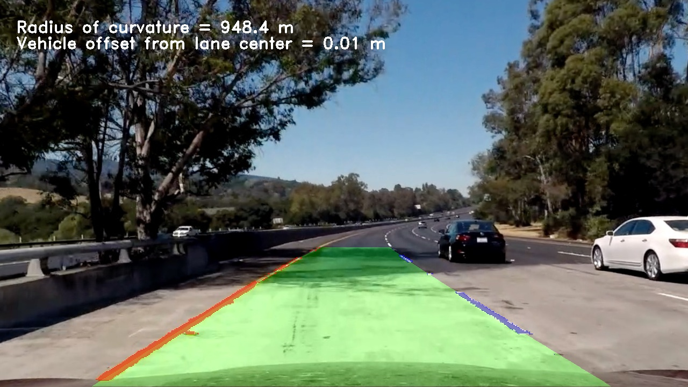

In case of videos, the fit results are compared across multiple frames and averaged for calculating the lane statistics.

# Steps of the video processing pipeline

In the following I am giving a high-level summary of the processing pipeline. For implementation details, please refer to the commented source code in [P2.ipynb](P2.ipynb).

The sequence of the pipeline for a single image is defined in cell 9 of the [Jupyter notebook](P2.ipynb).

## 1. Camera Calibration

The logic for calibrating the camera and undistorting source images can be found in code cell 3 of the Jupyter notebook [P2.ipynb](P2.ipynb).

Calibration is performed leveraging the `cv2.calibrateCamera()` and `cv2.findChessboardCorners()` function, using a pair of replicated chessboard coordinates and the matching image coordinates detected from a supplied set of calibration chessboard images from the subdirectory [calibration](calibration).

Any source image captured with the same camera can then be undistorted using the function `cv2.undistort()`.

In cell 4 a verification of the calibration is performed by applying a perspective transformation to one of the undistorted chessboard calibration image. The result is a flat and regular representation of the chessboard pattern:

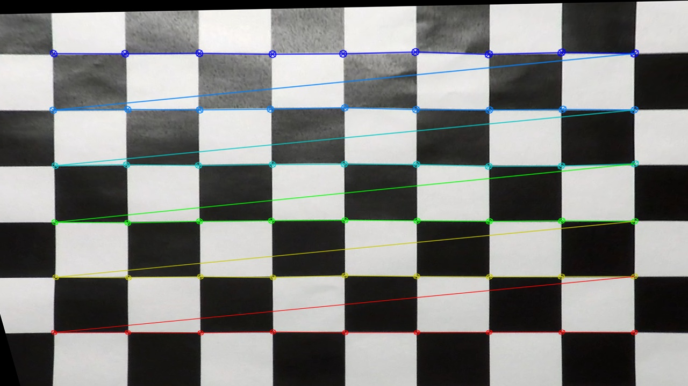

## 2. Apply a distortion correction to raw images

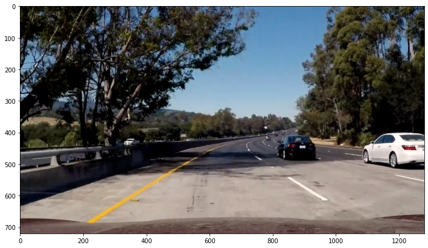

The first explicit step of the image processing pipeline (cell 9) is the undistortion of the source image, using the function `undistort_image()`, which in turn will invoke `calibrate_camera()` on demand (caching the calibration data on the first run).

The result of this correction is:

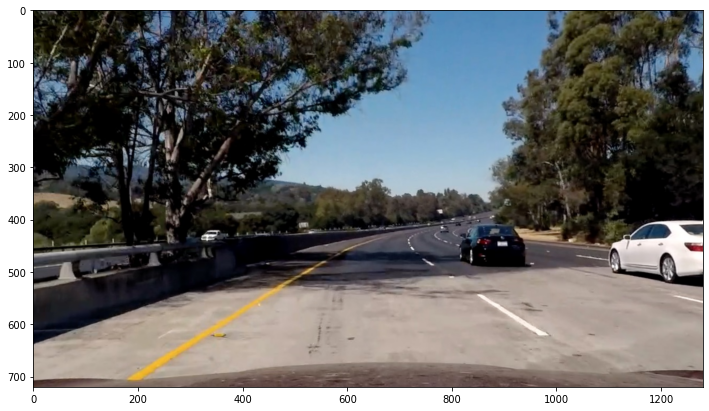

## 3. Using color and gradient transforms to produce a binary image

In cell 5, function `thresholds()`, a combination of color and gradient transforms is applied to reduce the image to a binary representation of elements relevant for identifying the lane.

A combination of S and R channel thresholds (110-255 and 150-255) proved effective in preserving the yellow lines. These areas are highlighted in blue in the following picture.

Another more narrow threshold window is applied to the R channel only (240-255) to identify white lines, here highlighted in red.

A horizontal gradient threshold (30-100, kernel size 5) is used to add the areas highlighted in green.

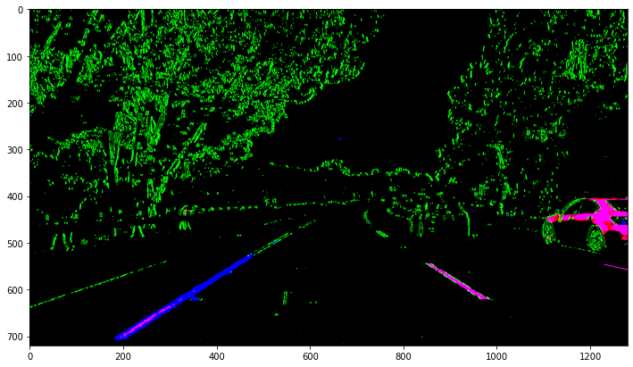

This combination of thresholds managed to narrow down the correct sections of the image most of the time, even in more difficult lighting situtions.

## 4. Perspective transformation

The perspective transformation is implemented in cell 6, function `warp_image()`, using `cv2.warpPerspective()`.

Again, memoization is used so that `cv2.getPerspectiveTransform()` only has to be called once per image size (in fact twice, another time for the inverse perspective transformation).

The coordinates for the source trapezoidal and target rectangle are defined in `warp_src()` and `warp_dst()`, relative to the image size.

These two images show the source trapezoidal area on the undistorted original image and the warped image after the transformation, were the marked area now matches the expected rectangular shape.

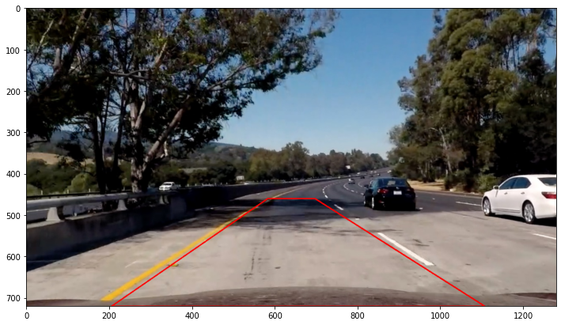

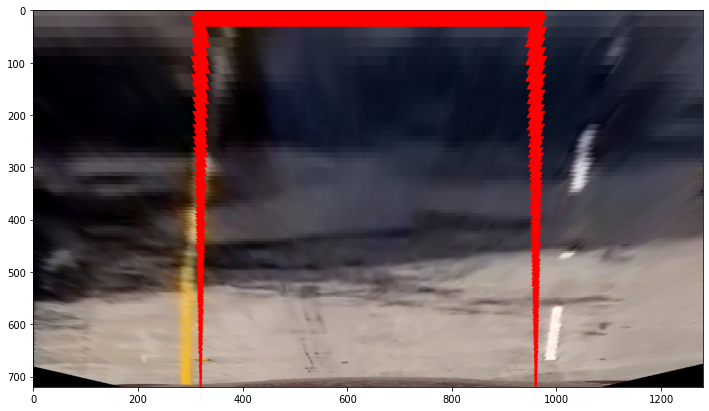

## 5. Lane pixel detection and fitting to the lane boundary

Lane pixel detection was applied to the binary warped image:

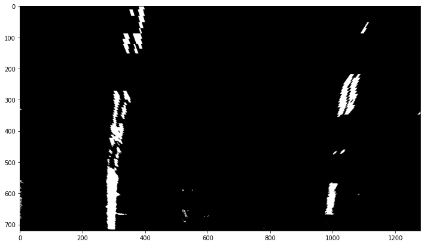

If not line fit from a previous image in a series was available, the technique of "sliding windows" was applied. Otherwise, an area around the previous line fit was used to identify and reapply the fit.

### 5.1. Sliding windows

See function `fit_lane_by_windows()` in cell 8.

First, a weighted histogram of pixels along the x axis is calculated, assigning higher weight to areas further down the y axis (closer to the vehicle). The peak in the left half of the image is used as a starting point for the left line, the same goes for the right half.

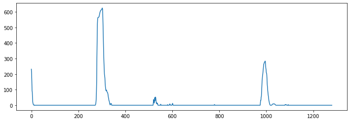

Windows of predefined size are drawn, starting at the bottom of the image and working their way up. Whenever a minimum number of pixel is detected in a windows, the following window is offset towards the mean horizontal position of those pixels.
In this implementation, the algorithm was modified to incorporate the offset of the previous window as well, making it more robust for curved lines.

Finally, using `cv2.polyfit()` a 2nd degree polynomial is fit to the selected pixels in each line of windows.

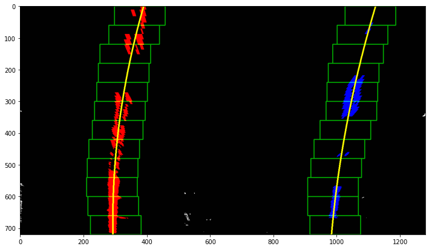

### 5.2. Fit based on previous detection

See function `fit_lane_around_poly()` in cell 8.

If a polynomial from a previous iteration (detection in videos) is available, the pixels for the next fit are selected using a horizontal band around that curve.

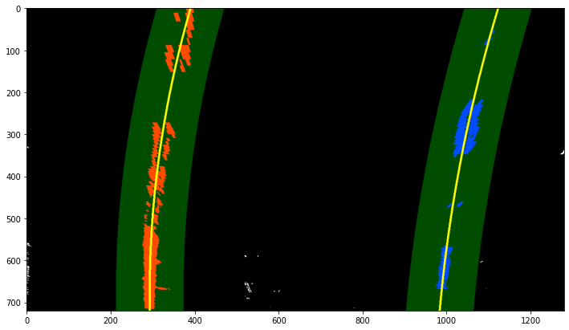

## 6. Calculating the radius of curvature of the lane and the position of the vehicle with respect to center

Based on the pair polynomial coefficients retrieved from a valid lane fit, the curvate radius and line offset from the vehicle are calculated for each line using function `calculate_stats()` in cell 7, line 74.

The average of those values from both lane boundaries are used to quote the final lane curvature radius and the offset of the vehicle from the lane center.

## 7. Drawing the detected lane area and statistics onto the result image

In cell 7, line 123, function `draw_lane_unwarped()`, the previous fit results are visualized by drawing the detected boundary pixels and the fitted lane area onto an undistorted source image.

This is the final result:

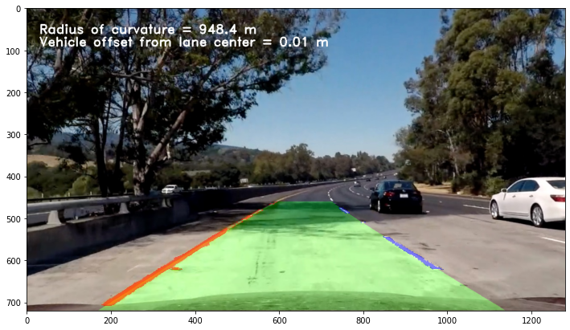

# Video pipeline

In case of video processing, special consideration is paid to verifying the sanity of each image lane fit result.
The goal is to avoid outliers which would "steer" the vehicle away from the lane and to smoothen the lane area drawn onto the output video.

The logic taking care of that part is placed in cell 8, line 216, function `fit_lane()` of the notebook.

If a certain number (5) of previous fit attempts have failed a new fit is attempted using the "sliding windows" technique, same as for the very first frame of a video.
Otherwise the method of "selecting along the previous curve fit" is used.

A lane fit is considered invalid, if
* the width of the lane (bottom and middle) is outside of a defined range, or
* the polynomials are intercepting, or
* the lines are not parallel, meaning that the difference of their 1st derivative is too large, or
* their curvature is not similar, meaning a too large difference of their 2nd derivative.

Valid fit coefficients are collected across multiple frames (up to 25) and their average is used to calculate lane fit statistics, again to smoothen the displayed result.

## Video results

Here are the results of my lane detection pipeline for the project videos:

* [The easy project video](output_videos/01_project_video.mp4)
* [The challenging video](output_videos/02_challenge_video.mp4)
* [The harder video](output_videos/03_harder_challenge_video.mp4)

# Discussion

The presented pipeline works adequately for the first two project videos. However, especially the sliding window technique is fine-tuned to the provided image dimensions and will file for any other camera perspectives or image sizes. It also won't be flexible enough for tighter curves and is easily confused by neighbouring gradient pixel lines.

In general, most logic presented in this implementation could use more generalisation or flexible adaptation to other input formats, frame rates and certainly daytime situations as well.

Experimenting with the degree of the polynomial fit, I noticed that the much tighter lane boundaries in the third project video are better matched by a 3rd degree polynomial.
Switching to 3rd degree for the other two videos, however, lead to more irradic results. For shorter line segments the fit is more likely to take extreme shapes with large gradients, the higher the allowed degree of the polynomial.

# Structure

* [README.md](README.md): this file.
* [P2.ipynb](P2.ipynb): The Jupiter notebook containing the executable code with detailed comments
* [input_images](input_images): Input folder for test images
* [output_images](output_images): Output folder for processed test images
* [input_videos](input_videos): Input folder for example videos
* [output_videos](output_videos): Output folder for processed example videos
* [examples](examples): Supplemental images for this Readme
* [camera_cal](camera_cal): Camera calibration images
* [.ipynb_checkpoints/*](.ipynb_checkpoints): Jupyter checkpoints for [P2.ipynb](P2.ipynb)

## License
The contents of this repository are covered under the [MIT License](https://github.com/mkleesiek/CarND-LaneLines-P1/blob/master/LICENSE).
